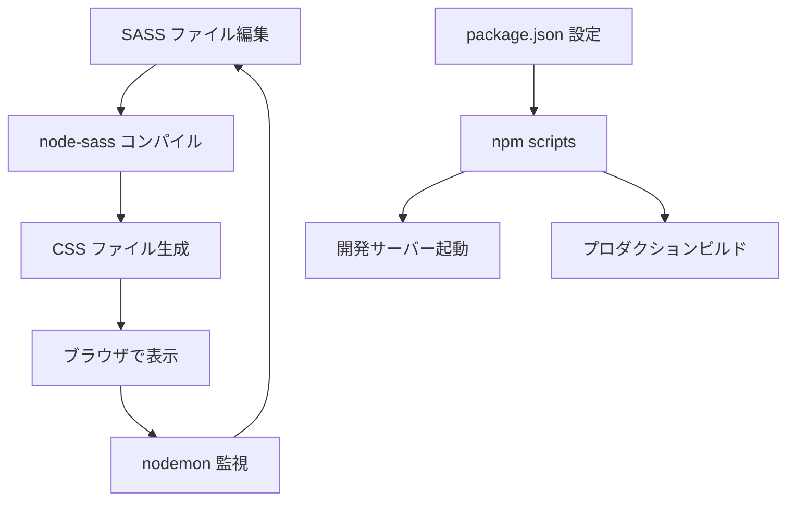
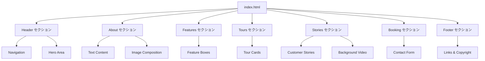
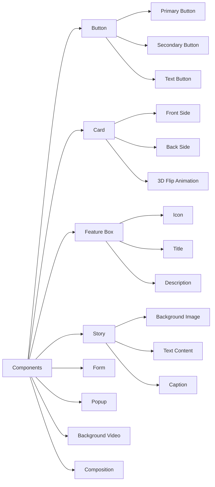
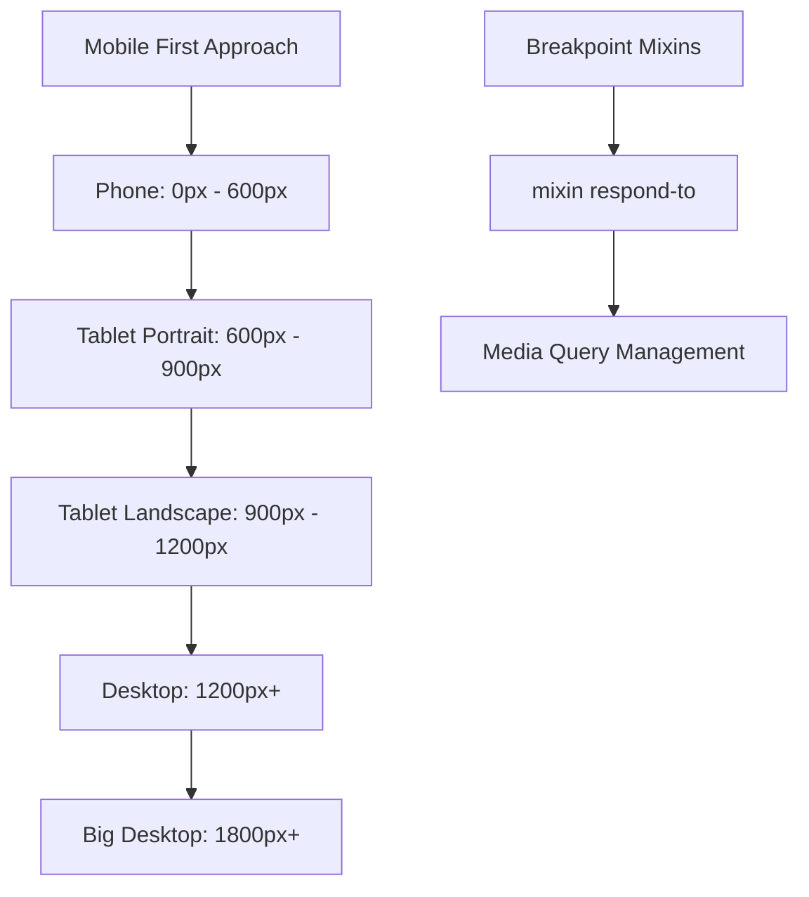
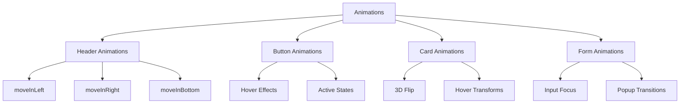
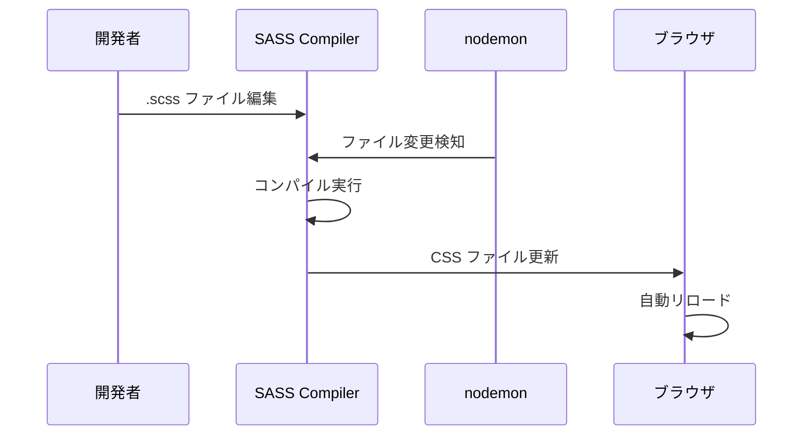

# Natours プロジェクト概要

## プロジェクト概要

**関連ソースファイル**
- package.json (1-25行)
- sass/main.scss (1-25行)
- index.html (1-541行)

## 目的と範囲

Natoursプロジェクトは、モダンでレスポンシブなウェブサイトを作成するための高度なCSSとSassテクニックを実演する教育的なフロントエンド開発ショーケースです。この単一ページの観光ウェブサイトは、CSS Grid、Flexbox、アニメーション、レスポンシブデザイン、およびコンポーネントベースアーキテクチャを習得するための包括的な学習プラットフォームとして機能します。

このドキュメントは、プロジェクトのアーキテクチャ、テクノロジー、および教育目標の高レベルな概要を提供します。

- SASSアーキテクチャの具体的な実装詳細については、**SASSアーキテクチャ**を参照してください
- ビルドシステムの設定については、**ビルドシステム**を参照してください
- 実演される高度なCSSテクニックについては、**高度なCSSテクニック**を参照してください

## プロジェクトアーキテクチャ

```
Natours Project/
├── sass/
│   ├── abstracts/
│   │   ├── _variables.scss
│   │   ├── _mixins.scss
│   │   └── _functions.scss
│   ├── base/
│   │   ├── _base.scss
│   │   ├── _animations.scss
│   │   ├── _typography.scss
│   │   └── _utilities.scss
│   ├── components/
│   │   ├── _button.scss
│   │   ├── _composition.scss
│   │   ├── _feature-box.scss
│   │   ├── _card.scss
│   │   ├── _story.scss
│   │   ├── _bg-video.scss
│   │   ├── _form.scss
│   │   └── _popup.scss
│   ├── layout/
│   │   ├── _header.scss
│   │   ├── _grid.scss
│   │   ├── _footer.scss
│   │   └── _navigation.scss
│   ├── pages/
│   │   └── _home.scss
│   └── main.scss
├── css/
│   └── style.css
├── img/
├── index.html
└── package.json
```

**出典:** package.json (1-25行)、sass/main.scss (1-25行)、index.html (1-541行)

## テクノロジースタック

プロジェクトは、プロフェッショナルな開発ワークフローで組織された現代的なフロントエンドテクノロジーの習得を実演します：

| テクノロジー | 目的 | 主要ファイル |
|-------------|------|-------------|
| **HTML5** | セマンティックなマークアップ構造 | index.html (1-541行) |
| **SASS/SCSS** | 高度なCSSプリプロセッシング | sass/main.scss (1-25行) |
| **Node.js** | ビルドシステムの基盤 | package.json (6-9行) |
| **node-sass** | SASSからCSSへのコンパイル | package.json (21行) |
| **nodemon** | 開発時のファイル監視 | package.json (22行) |
| **CSS Grid/Flexbox** | レイアウトシステム | レイアウトコンポーネントで参照 |
| **カスタムアイコンフォント** | スケーラブルなベクターアイコン | index.html (11行) |
| **Google Fonts** | タイポグラフィ（Latoフォントファミリー） | index.html (7-10行) |

**出典:** package.json (1-25行)、index.html (1-16行)

## 開発ワークフロー



**出典:** package.json (6-9行)、sass/main.scss (1-25行)

## ウェブサイト構造

`index.html`ファイルは、特定のSASSモジュールに対応する個別のセクションを持つ単一ページアプリケーションを定義します：



**出典:** index.html (51-502行)

## 主要な学習目標

Natoursプロジェクトは以下の高度なCSS/Sassコンセプトを実演します：

### SASSアーキテクチャ

- **7-1パターン**: `abstracts/`、`base/`、`components/`、`layout/`、`pages/`ディレクトリに組織化
- **デザイントークン**: `abstracts/_variables.scss`での変数の一元化
- **ミックスイン & 関数**: `abstracts/_mixins.scss`と`abstracts/_functions.scss`での再利用可能ユーティリティ
- **インポート戦略**: CSSカスケード管理のための`main.scss`での適切なインポート順序

### 高度なCSSテクニック

- **3D変形**: カードフリップアニメーション（`card`コンポーネント）での実演
- **CSS Grid**: レイアウトシステムの実装（`layout/_grid.scss`）
- **Flexbox**: コンポーネントレベルのレイアウト
- **CSSアニメーション**: キーフレームアニメーションとトランジション
- **Clip-path**: モダンな図形作成テクニック
- **カスタムプロパティ**: CSS変数の使用
- **レスポンシブデザイン**: ブレークポイントミックスインを使用したモバイルファーストアプローチ

### コンポーネントベースデザイン

- **モジュラーコンポーネント**: 自己完結型UIエレメント（`components/`ディレクトリ）
- **BEM方法論**: Block Element Modifier命名規則
- **再利用可能パターン**: アプリケーション全体での一貫したコンポーネント構造

**出典:** sass/main.scss (1-25行)、package.json (4行)、README.md (2-3行)

## コンポーネント詳細図



## レスポンシブブレークポイント



## 教育的コンテキスト

このプロジェクトは、Jonas SchmedtmannのUdemyコース「Advanced CSS and Sass: Flexbox, Grid, Animations and More!」に由来し、プロフェッショナルなフロントエンド開発実践の実用的な応用として機能します。コードベースは、本番環境で使用される業界標準のワークフロー、アーキテクチャパターン、およびモダンなCSSテクニックを実演しています。

**出典:** README.md (1-4行)、index.html (467-472行)

## アニメーション構造



## ビルドプロセス



---

*このドキュメントは、Natoursプロジェクトの包括的な概要を提供し、現代的なフロントエンド開発における高度なCSS/Sassテクニックの学習リソースとして設計されています。*
